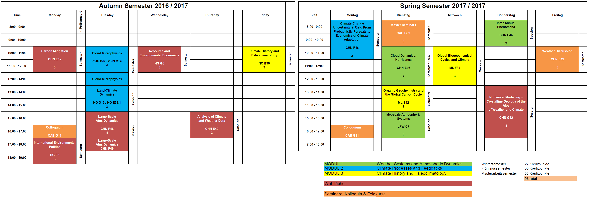

---
output:
  html_document: 
    toc: true
    toc_float: true
---

<link rel="stylesheet" href="styles.css" type="text/css">

## Lecture Summaries and Documents

- Cloud Microphysics: [4-Page Summary](eth_studium/cloud_microphysics_summary_maurice_huguenin_2016.pdf)

- Global Biogeochemical Cycles: [4-Page Summary](eth_studium/global_biogeochemical_cycles_summary_maurice_huguenin_2017.pdf)

- Cloud Dynamics Hurricanes: [4-Page Summary](eth_studium/cloud_dynamics_hurricanes_summary_maurice_huguenin_2017.pdf)

- Numerical Modelling of Weather and Climate: [Isentropic Model Report](eth_studium/numerical_modelling_report_maurice_huguenin_2017.pdf)

- Organic Geochemistry and the Global Carbon Cycle: [Long Summary](eth_studium/organic_geochemistry_and_the_global_carbon_cycle_summary_maurice_huguenin_2017.pdf)

- Resource and Environmental Economics: [Learning Goals](eth_studium/resource_and_environmental_economics_summary_maurice_huguenin_2017.pdf)

- Climate History and Paleontology: [Catalogue of Questions](eth_studium/climate_history_catalogue_questions_maurice_huguenin_2016.pdf)

## Stundenplan

Right-click & view image for fullscreen

## Lateral Epicondilitis

At the end of my Bachelor's in 2016, I started to write all my lecture summaries on my laptop. While working at uni, I always used the trackpad on my laptop. Slowly but surely I started to develop many [Lateral Epicondilitis](https://www.physio-pedia.com/Lateral_Epicondylitis) symptoms in my elbow, forearm and fingers: from pain, stiffness and throbbing all the way to tingling sensations and cramps. These symptoms are sometimes also called Tennis Elbow or Repetitive Strain Injury (RSI) syndromes. Whenever the pain was bad, I just started to use my other hand to continue working. After a few months I had symptoms in both of my forearms. Using a regular mouse also really hurt. My dad developed the same injury many years ago and could help me with helpful tips. As a note to the trigger he calls it 'Epicondilitis Microsoftis Mausis'. 

There are many ways to reduce the pain while continuing work on a computer, here are the ones that worked for me:

- [exercises](images/epicondilitis_exercises.jpg) that focus on stretching the forearm muscles and tendons. I also use 1 kg dumbbells for some exercises.
- using a tablet and pen instead of a mouse, I use the [Wacom Intuos Pro](https://www.wacom.com/en-us/products/pen-tablets/wacom-intuos-pro) tablet which really made a difference
- massaging the upper forearm with either a warm towel or a large ice cube
- wearing a wrist brace
- using the [Wellnomics](https://wellnomics.com/) ergonomcis software to take regular breaks from computer work
- my dad's symptoms got really bad and he started to use a voice recognition software to dictate texts and emails

## To Do

- Post summaries from my ETH lectures
- Include organisation and planning tips
- Complete Paleoclimate Proxy Document
- Write section on Repetitive Strain Injury (RSI), wacom tablet and ergonomics
- Upload LaTeX proposal and thesis templates with comments

