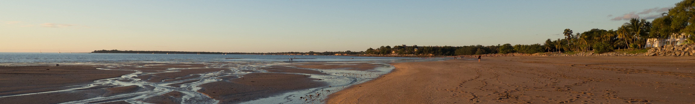

---
---
  
<link rel="stylesheet" href="styles.css" type="text/css">

Mindil Beach, Darwin, NT, Australia

  

 <!-- Justify text. -->

I am a climate science PhD candidate at UNSW and investigate ocean heat content changes with a global climate model. Since 1970, the ocean has absorbed over 90% of the excess energy in our climate system. Investigating where, how and why the ocean is warming is critical to prepare for its impacts. These include sea level rise, increased stress for marine ecosystems and changes in the frequency of extreme weather events.

I completed my Bachelor's in Earth Sciences and Master's in Atmospheric and Climate Science at ETH Zurich in Switzerland. This education provided me with invaluable data analysis tools and an in-depth understanding of the complexities within our climate system.

As part of my PhD and a ship-based research effort, I envision myself stepping onto Antarctica.

<!--- My full CV is available [here](files/CV_Maurice_Huguenin_20190810.pdf). --->

<!--- Thanks to Emily Zabor (https://github.com/zabore) for allowing me to use her code. --->
