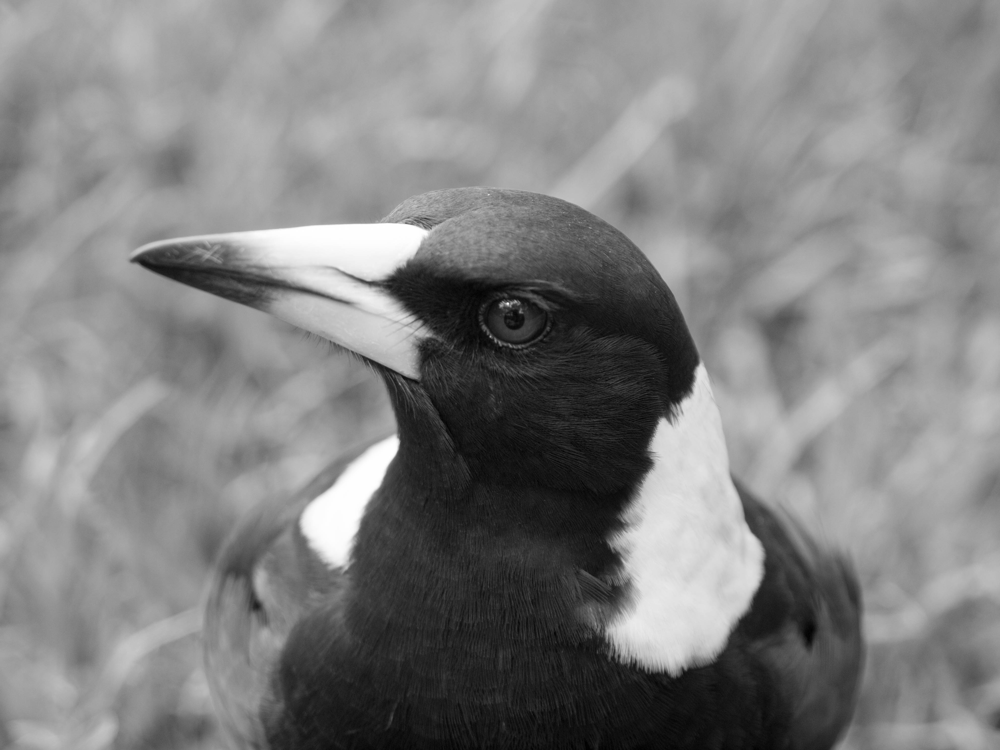
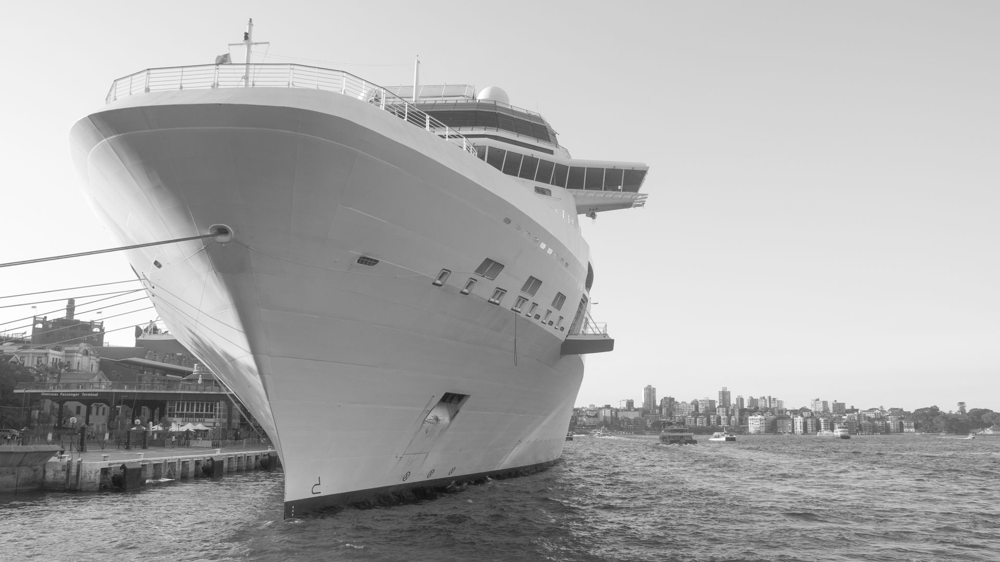
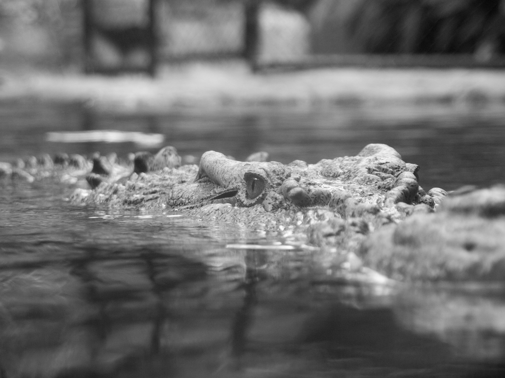
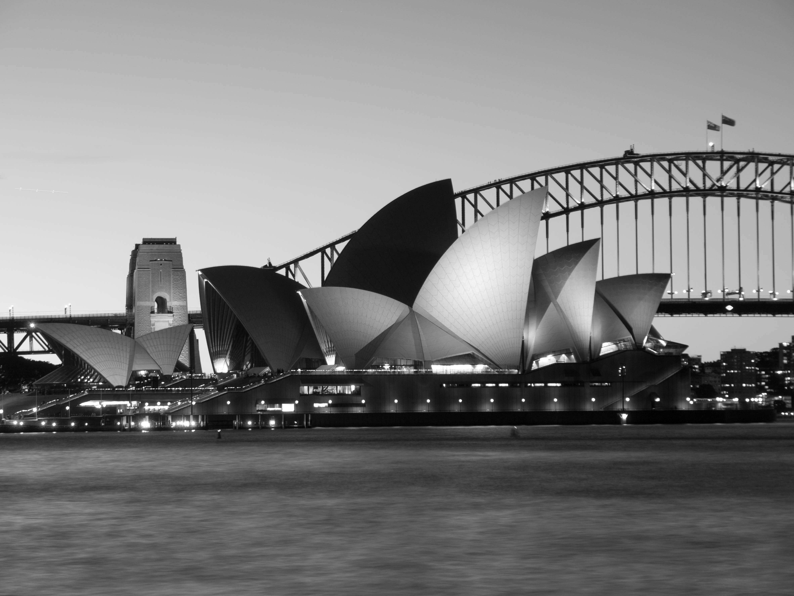

<link rel="shortcut icon" type="image/x-icon" href="favicon.ico">
<link rel="stylesheet" href="styles.css" type="text/css">

## Blue Hour Tips

The Blue Hour is the period of the day before or after sunset when the sky is still blue. Usually it lasts about 30 minutes. Key is to have an even surface (or tripod) to stabilise the camera as exposure times of more than one second are necessary.

Blue Hour at Marina Bay, Singapore

* [https://www.bluehoursite.com/](https://www.bluehoursite.com/) is helpful in determining when the Blue Hour happens at your location.

* Camera Settings: Aperature priority (A) with f4.5 or higher, ISO 200+, Manual focus (MF) and 2 sec. timer with Anti-Shock activated

## Top 5 Black and White Sydney

Airbus A330 at Kingsford Smith Airport

Australian Magpie

Carnival Spirit at Circular Quay

Saltwater Crocodile

Opera House and Harbour Bridge 

... many more to come!

