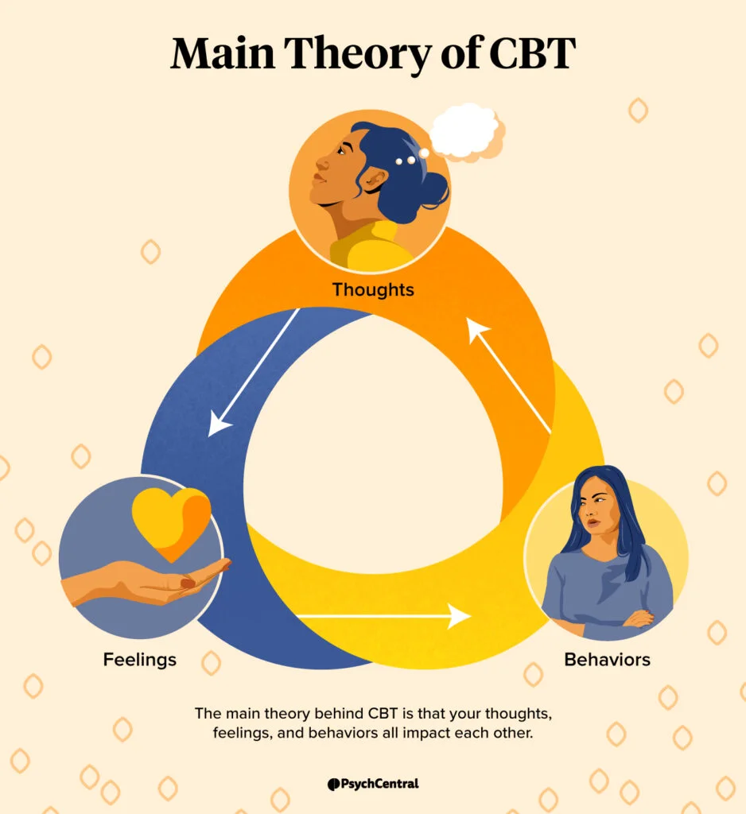

<link rel="shortcut icon" type="image/x-icon" href="favicon.ico">
<link rel="stylesheet" href="styles.css" type="text/css">

## Documents
- 

## Mental health resources

- Book: Leading Change - Why Transformation Efforts Fail by John Kotter
- Book: It's Your Ship: Management Techniques from the Best Damn Shop in the Navy by Captain D. Michael Abrashoff
- Essay: What makes a leader? by Daniel Goleman 
- Book: Meditations by Marcus Aurelius
- Essay: Self-relience by Ralph Waldo Emerson
- Essay: What is Enlightenment? by Immanuel Kant
- Book: Managing your mental health during your PhD by Zo Ayres
- Book: HBR's 10 Must Read On Managing Yourself
- Book: HBR's 10 Must Read On Communication
- Book: HBR's 10 Must Read On Leadership
- Essay: Managing Oneself by Peter F. Drucker
- Essay: How will you measure your life? by Clayton M. Christensen
- Speech: Citizenship in a Republic by Theodore Roosevelt
- Speech: The strenuous life by Theodore Roosevelt
- Essay: Emotional Intelligence has 12 Elements. Which do you need to work on? by Daniel Goleman and Richard E. Boyatzis
- Essay: Make your values mean something by Patrick M. Lencioni
- Poem: Ulysses by Alfred, Lord Tennyson
- DMF technique by Nick Goldsmith (former Royal Marine Commando with PTSD)
  - **D**istract (go for walk), **M**usic (listen to nature), **F**ood (get something good into your stomach)
  - [https://www.youtube.com/watch?v=S9WC8bl54Mo](https://www.youtube.com/watch?v=S9WC8bl54Mo)
- Pillars of mental health: i) sleep, ii) good nutrition, iii) exercise, iv) socialising in a safe way
- **THINK** before you speak: Is it **T**rue?, **H**elpful?, **I**mportant?, **N**ecessary?, **K**ind?
- 
